[TOC]

# 开发环境

> feigebuge推荐环境
> - JDK: JDK 11.0.25
> - Gradle: Gradle 8.0
> - IDE: IntelliJ IDEA 2023.2.3
> - 项目启动的IDE: IntelliJ IDEA 2022.2.3

# HELPER v1.0


## 整体架构

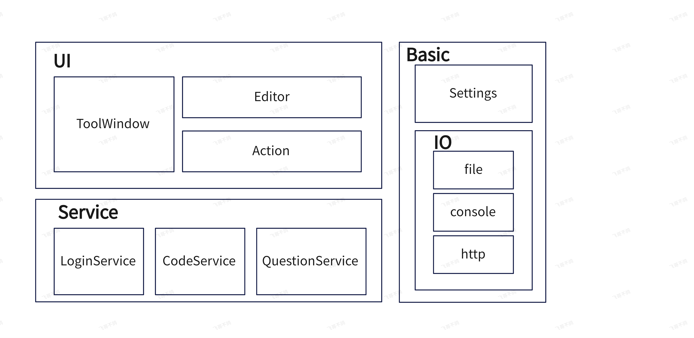

项目分为三层，分别是

- UI层：负责和idea交互，编写显示界面
  - ToolWindow：工具窗口，插件项目数据显示的主题部位
  - Editor：提供特定内容的显示编辑器
  - Action：与UI进行交互
- Service层：处理业务逻辑，负责数据与UI的交互
- Basic层：提供支持环境，目前包括setting和IO模块
  - setting：项目设置模块，可以在File->Settings部位进行项目设置
  - IO
    - file：处理文件IO
    - console：负责控制台IO
    - http：负责网络IO，处理与leetcode平台的请求


## Setting

该模块用三各类维护

- AppSettings：包含需要idea持久的配置数据，目前需要持久化的数据有三，分别是`langType`, `filePath`, `coreFilePath`
  - langType：表示当前选择的语言，当选定langType后，插件会自动创建与langType匹配的代码文件
  - filePath：指定代码文件创建目录
  - coreFilePath：指定缓存文件创建目录，该值会在用户第一次设置·filePath`时确定，**项目只允许创建一次**
- AppSettingsComponent：提供设置的UI界面
- AppSettingsConfigurable：配置类，注册到idea当中，提供持久化AppSettings数据的能力


## IO-File

提供与disk，memory交互的能力

**架构图**


`StoreService`目前提供缓存 + 持久化能力

其中缓存能力分为非持久化缓存（cache），持久化缓存（durableCache）。StoreService采用K-V结构存储数据，并在内部通过StoreContent对V进行封装。每一个缓存的数据都会序列化为Json

StoreService提供缓存时间检测功能，但目前该功能并未在项目中真正启用

此外，`StoreService`通过`@Service`注册为idea Project级别服务，有idea管理类的生命周期。在插件项目关闭之前，会调用`StoreService`的**persistCahce()**方法，将durableCache内的数据写入磁盘，存储为**app.properties**，磁盘路径由**Settings模块的coreFilePath决定，通过AppSetting对外暴露的getCoreFilePath提供存储路径**


## IO-HTTP

### 1.总体介绍


使用apache的httpclient框架作为底层请求支持，在此基础上根据lc-runner业务进行封装


总体来说分为两层，第一层HttpClient，封装httpclient提供的基础能力，对外暴露发送get和post请求方法，此外支持cookie的相关操作


第二层是LeetcodeClient，封装HttpClient提供能力，对业务提供各种业务接口，诸如`登录判断`，`题目获取`,`代码提交`等功能，该模块直接对接`service`模块


另外，针对http的请求和响应，项目也做了一定封装——`HttpRequest`，`HttpResponse`


### 2.细节描述

leetcode接口采用graphql技术，按需分配资源，关于该技术的详细介绍，可自行搜索


关于该技术对于本项目的影响，体现在Request Body的构建上


在没运用graphql技术前，不同资源是按照url请求路径区分，但应用该技术后，对于国内leetcode来说，大部分资源请求url都是https://leetcode.cn/graphql，而区分资源是依赖请求体


以**题目内容查询、用户状态查询**接口为例

> 题目内容查询
>
> url = https://leetcode.cn/graphql
>
> body = 
>
> ```json
> {
>     "query": "\n    query problemsetQuestionList($categorySlug: String, $limit: Int, $skip: Int, $filters: QuestionListFilterInput) {\n  problemsetQuestionList(\n    categorySlug: $categorySlug\n    limit: $limit\n    skip: $skip\n    filters: $filters\n  ) {\n    hasMore\n    total\n    questions {\n      acRate\n      difficulty\n      freqBar\n      frontendQuestionId\n      isFavor\n      paidOnly\n      solutionNum\n      status\n      title\n      titleCn\n      titleSlug\n      topicTags {\n        name\n        nameTranslated\n        id\n        slug\n      }\n      extra {\n        hasVideoSolution\n        topCompanyTags {\n          imgUrl\n          slug\n          numSubscribed\n        }\n      }\n    }\n  }\n}\n    ",
>     "variables": {
>         "categorySlug": "all-code-essentials",
>         "skip": 0,
>         "limit": 1,
>         "filters": {
>             "searchKeywords": "3254"
>         }
>     },
>     "operationName": "problemsetQuestionList"
> }
> ```


> 用户状态查询
>
> url = https://leetcode.cn/graphql
>
> body = 
>
> ```json
> {
>     "query": "\n    query globalData {\n  userStatus {\n    isSignedIn\n    isPremium\n    username\n    realName\n    avatar\n    userSlug\n    isAdmin\n    useTranslation\n    premiumExpiredAt\n    isTranslator\n    isSuperuser\n    isPhoneVerified\n    isVerified\n  }\n  jobsMyCompany {\n    nameSlug\n  }\n  commonNojPermissionTypes\n}\n    ",
>     "variables": {}
> }
> ```


通过上述两个demo可以发现，运用了graphql技术的接口，请求体的构建相对麻烦


基于此，封装如下三个类，帮助创建请求体


- GraphqlReqBody，负责构建请求体
- SearchParams，是GraphqlReqBody的内部类，负责构建variables变量
- ParamsBuilder，是SearchParams的内部类，通过建造者模式辅助构建SearchParams


### 3. 使用Demo

```java
// 辅助构建varablies
GraphqlReqBody.SearchParams params = new GraphqlReqBody.SearchParams.ParamsBuilder()
    .setCategorySlug("all-code-essentials")
    .setLimit(limit)
    .setSkip(skip)
    .build();
// 构建graphql请求体
GraphqlReqBody body = new GraphqlReqBody(LeetcodeApiUtils.PROBLEM_SET_QUERY);
body.setBySearchParams(params);
// 构建httpRequest
HttpRequest httpRequest = new HttpRequest.RequestBuilder(url)
    .setBody(body.toJsonStr())
    .setContentType("application/json")
    .addBasicHeader()
    .build();
// send request
HttpResponse httpResponse = httpClient.executePost(httpRequest);
String resp = httpResponse.getBody();
```


## IO-Console

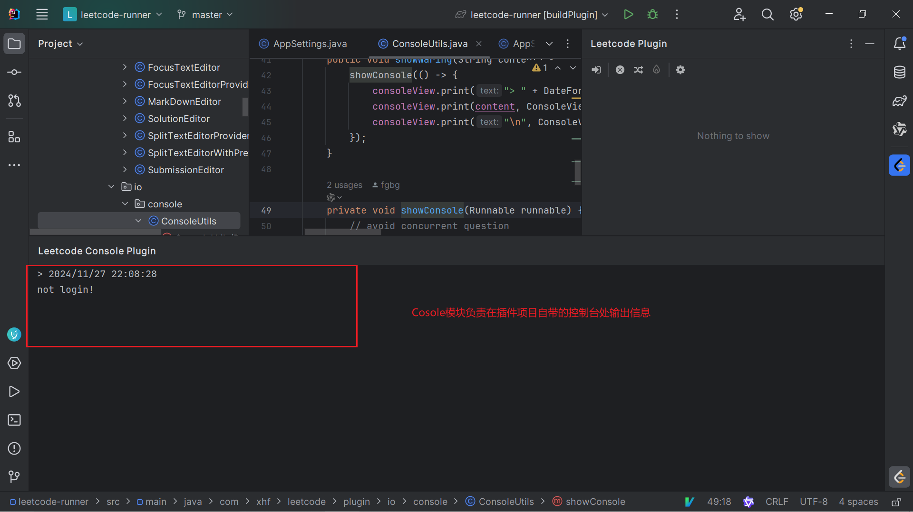

console模块负责在插件自带的控制台上输出信息


## UI-Action

官方定义：The IntelliJ Platform calls the actions of plugins in response to user interactions with the IDE

Action，通过继承AnAction类来提供用户与IDE的交互能力，在编写完代码后，需要在plugin.xml中进行注册


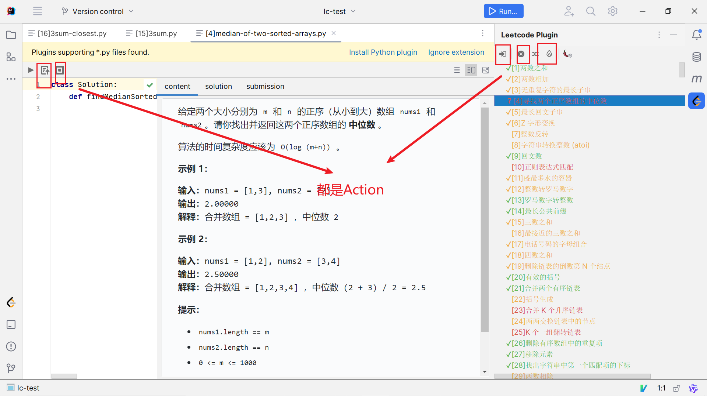


在本项目中，通过继承`AbstractAction`类来规范化每一个Action的行为。在`AbstractAction`中，会检查**登录状态**和**设置状态**，如果有`@LoginPass`或者`@SettingPass`注解，那么在对应检测环节则会被放行，否则进行拦截检测


> ActionGroup，本质上也是Action，只不过他是一组Action的集合，可以在xml中用<group>标签注册

```xml
        <!--注册Action-->
		<action id="leetcode.plugin.LoginAction" class="com.xhf.leetcode.plugin.actions.loginAction"
                text="Sign In" icon="/icons/login.png">

		<!--注册Group-->
        <group id="leetcode.plugin.lcActionsToolbar">
            <reference id="leetcode.plugin.LoginAction"/>
            <separator/>
        </group>
```


## UI-ToolWindow

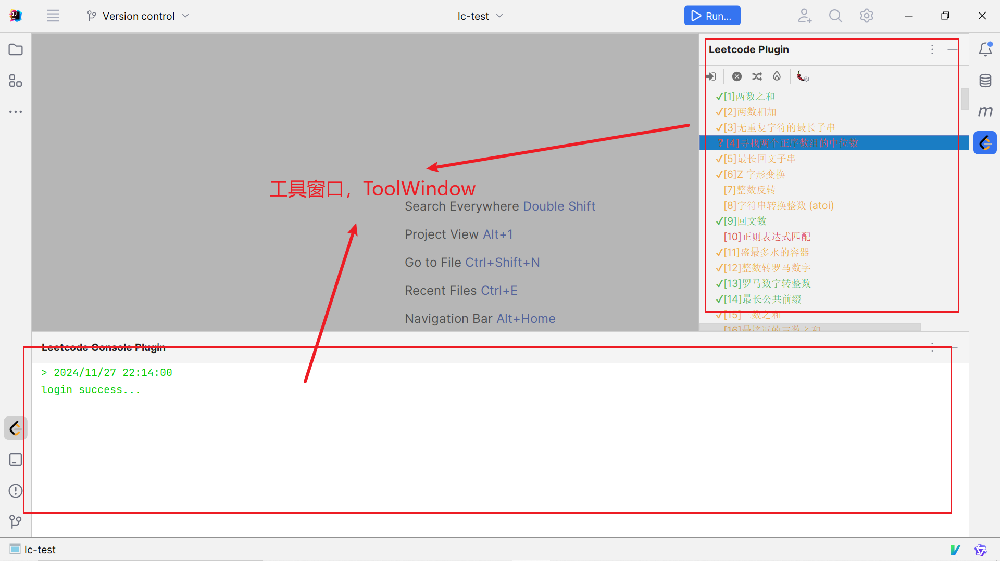

工具窗口，拓展idea功能的窗口，本项目关于这部分的模块图如下

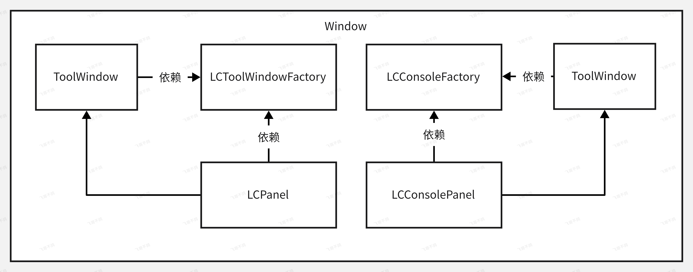

`ToolWindowFactory`负责为`ToolWindow`创建内容，`Panel`则是`ToolWindow`显示内容的载体

ToolWindow由idea自身提供，ToolWIndowFactory负责将Panel添加到ToolWindow内


在本项目中，Panel所在位置如下所示

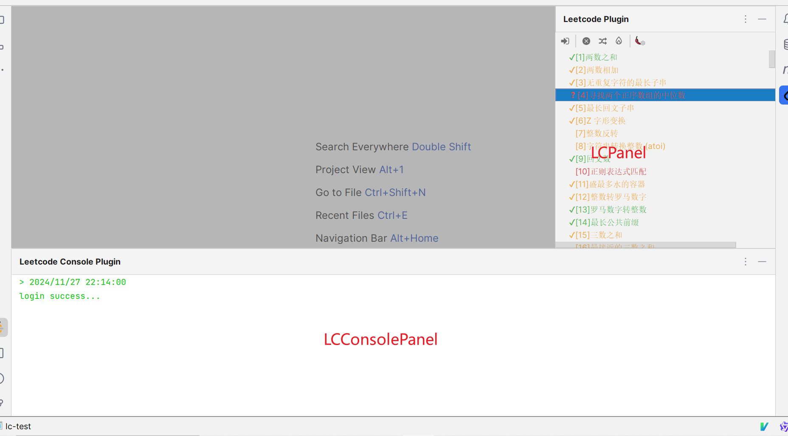

- LCPanel：包含两部分数据内容，分别是Toolbar工具栏，JBList列表。LCPanel通过继承DataProvider提供对外暴露JBList的能力
- LCConsolePanel：只包含ConsoleView，LCConsolePanel同样通过继承DataProvider提供对外暴露consoleView的能力


## UI-Editor

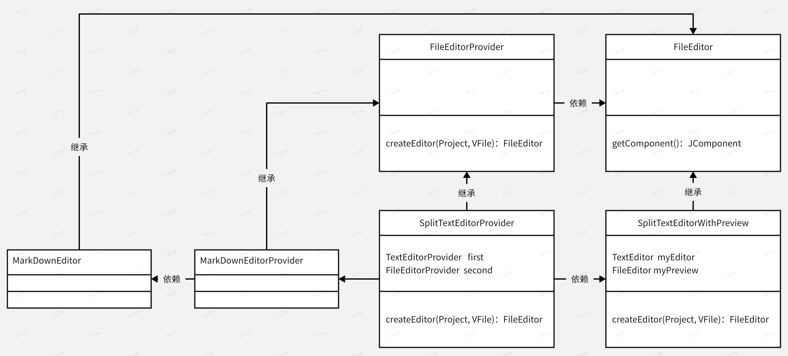

Editor，提供特定文件的编辑显示能力。比如说普通的文本编辑器，只会显示html代码。但自定义的Html编辑器，则会按照html的语法，显示内容


在idea中，提供自定义文本编辑器依赖于两个类

- FileEditorProvider：负责提供FileEditor，同时检测特定文件是否支持用特定Editor打开
- FileEditor：负责处理文件内容，提供显示的JComponent


在本项目中，为了支持分屏显示代码和题目内容，使用`SpliterTextEditorProvider`和`SplitTextEditorWithPreview`提供相关能力


- SpliterTextEditorProvider：在提供分屏Editor的同时，检测当前文件是否支持分屏Editor预览。该类通过查询StoreService中是否缓存相关文件信息，来判断当前文件是否支持SplitTextEditor
- SplitTextEditorWithPreview：提供分屏预览能力，在本项目中，第一块分屏是`PsiAwareTextEditorImpl`，第二块分屏是`MarkDownEditor`


> MarkdownEditor，在第一个版本中，并不支持markdown内容的显示，只支持HTML代码的显示。其显示原理是，读取自定义的HTML模板代码，同时将HTML代码注入其中。然后通过JCEF技术，启动`CefBrowser`，通过模拟浏览器的方式打开处理后的HTML内容


## Service-LoginService

loginService，负责处理登录有关的逻辑，利用JCEF技术，模拟启动浏览器，通过加载leetcode登录界面来提供登录功能

> 需要注意的是，当前leetcode并不支持通过uesrname和password的方式用本地代码模拟登录。leetcode官网存在参数校验的机制，在发出登录请求的同时会携带该参数。该参数只有在官网登录的时候才会携带，单纯的代码模拟无法正确登录

每当`JBCefClient`加载状态改变，都会执行监控逻辑，检测当前`CefCookieManager`中是否存在name为`LEETCODE_SESSION`的Cookie，如果存在，缓存到**HTTP**模块，同时通过`StoreService`进行持久化，登录完成后关闭当前登录窗口，加载题目信息，更新`LCPanel`

为了判断当前项目是否登录，`LoginService`对外暴露`isLogin`接口，该接口原理是通过`LoginService`内部的**loginFlag**参数和**LeetcodeClient**提供的接口共同判断，前者判断插件是否执行成功过登录逻辑，后者判断当前cookie是否能够代表客户端成功登录


## Service-QuestionService

questionService，负责处理question相关逻辑。


`loadAllQuestionData`，该方法会在后台查询所有leetcode问题，查询完成后更新LCPanel暴露的JBList


其余业务内容注释中都有解释，没啥好说的


## Service-CodeService

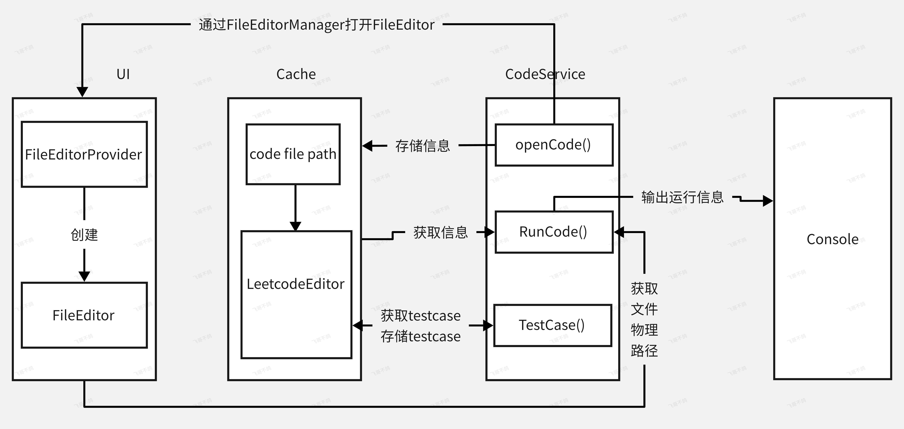

上图表示CodeService与其他模块的沟通信息


首先介绍`LeetcodeEditor`，该类用于存储围绕题目内容，创建editor所需要的相关信息


- questionId：当前题目的id
- lang：编写当前题目用当的语言类型，比如java或者python
- exampleTestcases：当前题目运行的测试样例【后续可以通过`TestcaseAction`更改】
- markdownContent：**题目内容**【MarkDownEditor渲染所需的内容来源】
- titleSlug：题目的slug标签，用于唯一标识题目，**该字段是http模块发送请求时的必要字段**
- defaultTestcases：官方提供的测试用例


LeetcodeEditor会在`openCode()`方法中被创建，然后存储到storeService中

openCode()通过点击LCPanel显示的JBList触发，该方法的大致逻辑是

1. 填充用户选定的question，丰富其中的信息
2. 创建code文件，获取文件路径
3. 创建并存储leetcodeEditor，维护额外信息。存贮的key是code文件的**文件路径**
4. 打开文件，并用SplitTextWithPreview显示


runCode()，通过当前打开的FileEditor获取显示的code文件路径，以此作为key，从cache中获取LeetcodeEditor维护的信息，然后执行运行逻辑，将代码通过`LeetcodeClient`提交到Leetcode平台。运行的结果在通过`ConsoleUtils`输出到控制台


TestCase()，与runcode类似，通过code 路径获取leetcodeEditor信息。创建Dialog与用户交互，将用户提供的测试数据存入LeetcodeEditor内，更新测试用例


> Tip：在runCode()方法中，通过`AbstractResultBuilder`将运行结果转化为String，然后再将String交由ConsoleUtils输出
>
> 有关于`AbstractResultBuilder`类的详细内容，请参考源码


# v2.0

新增内容

- 登录模块，新增cookie登录
- editor模块，支持同时阅览`题目内容`，`题解`, `提交记录`。支持html于markdown的内容阅览
- 新增http处理器
- 新增事件总线，解耦模块


## LoginService-CookieLoginWindow


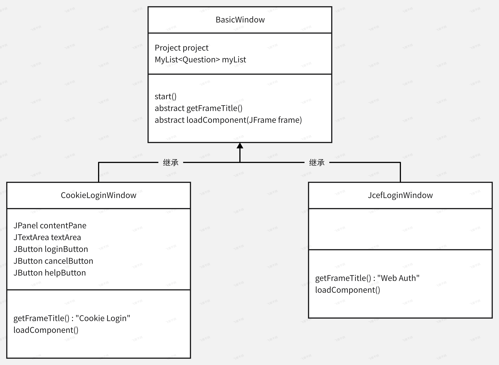

Cookie登录和Jcef登录存在通用逻辑，因此向上抽取抽象类


BasicWindow通过start()方法启动，getFrameTItle(), loadConponent()方法下放到子类实现。前者要求子类设置启动window的title，后者要求子类填充window的内容


此外，CookieLoginWindow用JTextArea要求用户输入名为`LEETCODE_SESSTION`的Cookie信息


## UI-Editor


Editor模块稍显复杂，文档将会按照等级依次介绍

### 1. SplitTextEditorProvider 和SplitTextEditorWithPreview

SplitTextEditorProvider 提供SplitTextEditorWithPreview，SplitTextEditorWithPreview提供第一层的分屏预览能力，左侧是编码区域，右侧是内容预览区域

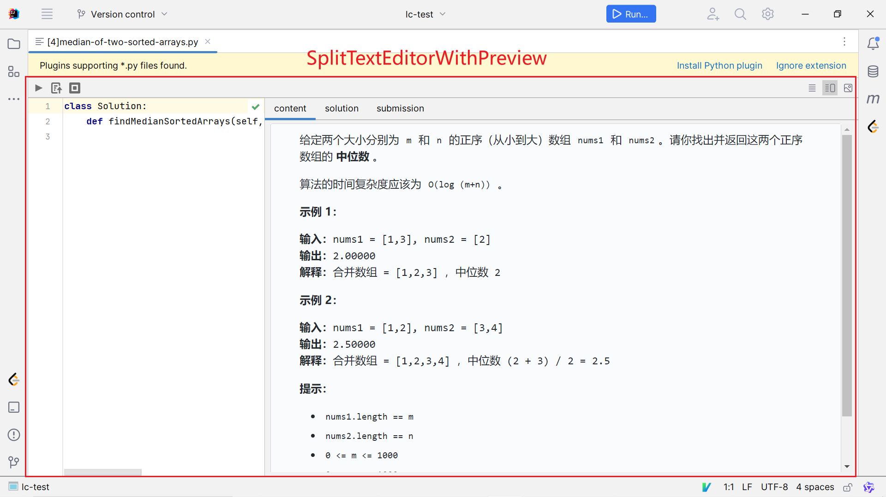


### 2.PsiAwareTextEditorImpl和FocusTextEditor

PsiAwareTextEditorImpl作为SplitTextEditorWithPreview左侧的编辑区域，提供代码编辑能力

FocusTextEditor作为右侧编辑区域，提供tabs显示能力，包含三个tab，每个tab的显示内容由3个FileEditor维护

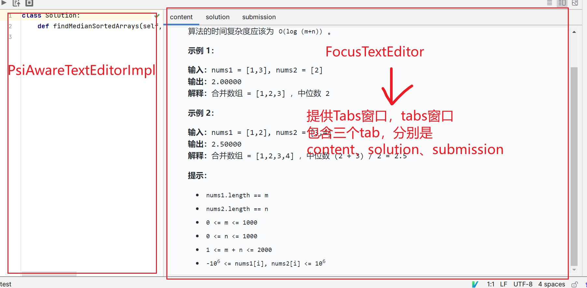


### 3.MarkDownEditor、SolutionEditor、SubmissionEditor

#### i.MarkDownEditor

MarkDownEditor，提供HTML、Markdown内容的显示能力，其原理是通过JCEF加载处理后的HTML文件，通过模拟浏览器选软HTML内容

Markdown内容渲染，使用前端vditor框架渲染。因为该框架在项目首次启动**渲染Markdown耗时很长**，因此在渲染HTML的时候会**提前加载需要的js、css文件**

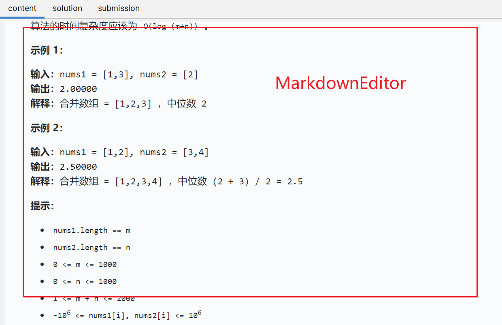


#### ii.SolutionEditor、SubmissionEditor

SolutionEditor、SubmissionEditor分别提供题解、提交记录显示

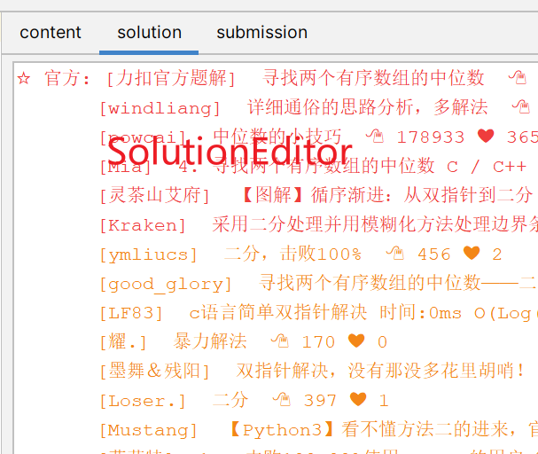

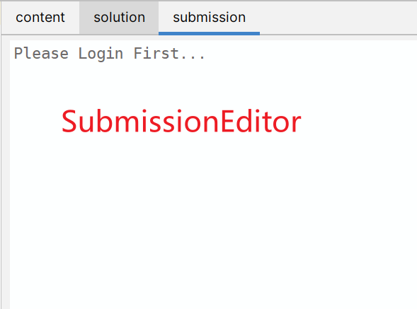

上述两种FileEditor都需要分屏显示功能，因此向上抽取`AbstractSplitTextEditor`抽象类，提供分窗能力

**AbstractSplitTextEditor**


- AbstractSplitTextEditor核心组件`jbSplitter`，提供分屏显示的能力

- createToolbarWrapper()为component创建工具栏，提供关闭右侧分屏的能力

- initFirstComp()的实现下放到子类，初始化分屏左侧内容

- openSecond(String)的实现下放到子类，创建右侧分屏内容

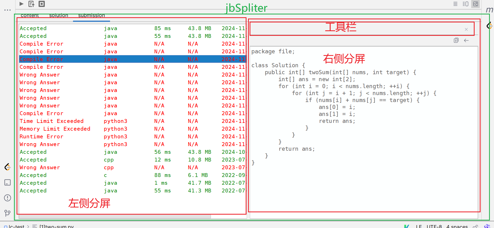


## IO-HTTP

当前http模块通过web方式，提供resource目录下的资源内容。当前模块服务于markdown内容显示

本项目中，采用JCEF方式模拟浏览器，使用前端框架`vditor`渲染markdown内容。markdown的内容显示依赖于框架js、css代码，因此需要提供web能力，加载文件内容


`LocalHttpRequestHandler`负责拦截idea发出的http请求，如果请求前缀是"/leetcode-project/"，则交由`LocalResourceController`负责处理，读取resource目录下的js、css文件内容


## Bus

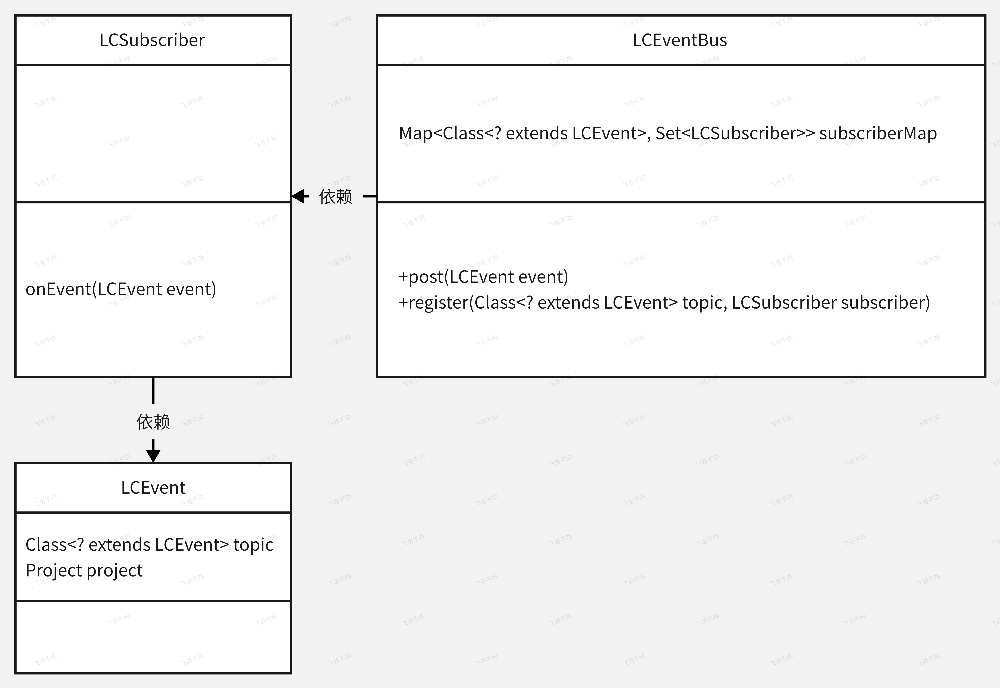

总线模块，提供注册和发送消息的能力。订阅方注册到特定的Topic内，接受投放到Topic中的消息内容

`LCSubscriber`，订阅者，当特定Topic内存在消息，订阅者的`onEvent()`方法将会被触发

`LCEventBus`，提供消息投递和订阅者注册功能。`LCEventBus`允许将订阅者注册到内部的订阅池，并按照不同的Topic进行存储，每个Topic是`LCEvent`的子类的class。当有观察者通过`LCEventBus`投递消息，`LCEventBus`将会通知订阅相关Topic的所有订阅者


# V2.6【大更新】

更新点主要有

1. 搜索功能
2. 事件总线


## 搜索功能

搜索功能对外提供问题搜索能力，其原理是基于Lucence开发中文文本分析器，将文本分析结果输入Lucence后，构建倒排索引，从而加快搜索能力，下图则是搜索模块实现的功能预览图


有关更详细的信息，可以参考笔者的这篇文章：[基于Lucence开发一个中文分析器](https://blog.csdn.net/qq_62835094/article/details/144428011?spm=1001.2014.3001.5502)


有关搜索功能的相关代码，都存放在search包下


下面通过gif的方式介绍中文分析器的整体工作流程


- step1：数据管理模块加载分段数据
- step2：分词处理器迭代处理分段数据
- step3：分段数据处理完成，跳转至step1
- step4：所有数据加载完毕，终止处理


通过上图我们可以发现，整个处理流程可以划分为两个模块
1. 数据管理模块
2. 分词处理模块


### 模块整体设计

下图为笔者的模块设计图


### 数据管理模块

#### SourceManager
SourceManager（简称SM），负责维护数据源source，同时管理分段数据SourceBuffer（简称SB）。对外通过迭代器，提供底层数据的访问

SM封装了底层对于数据的管理，当迭代到分段数据的边界时，会自动进行分段数据的加载。为了实现这一功能，SM封装了两个迭代器，`IteratorAdvance`和`CaptureIterator`。

#### SourceBuffer

SourceBuffer，维护分段数据，SM从soure中读取的分段数据会写入SB，SB内部维护迭代器`Itr`，通过Itr的迭代来对外提供底层数据的访问。需要注意的是，凡是被Itr迭代过的数据，都会被SB视为**已消费**，**被消费过的数据不会被重复访问**

#### IteratorAdvance

`IteratorAdvance`增强迭代器（简称ItrAdv），是对SB的`Itr`的增强。ItrAdv和Itr共同继承`com.xhf.leetcode.plugin.search.Iterator`接口，拥有迭代数据的能力。但ItrAdv本身并不能对SB的数据进行迭代。ItrAdv通过持有Itr，使用Itr来间接迭代SB。**如果ItrAdv发现SB数据被迭代完后，ItrAdv会自动加载分段数据**，从而屏蔽消费者对分段数据的感知。ItrAdv的增强设计参考了Spring的Aop，可以认为ItrAdv对Itr的增强属于AOP的环绕增强，只不过AOP运用的是反射机制，ItrAdv使用的是组合模式

#### CaptureIterator
`CaptureIterator`快照迭代器（简称CI），是为了应对中文分词处理边界数据遇到的问题而引入的解决方案，CI迭代到边界数据时会触发`SM的预加载机制`，配合PreBuffer避免影响底层的SB数据。

有关CI引入的详细原因，`SM的预加载机制`等细节，可参考项目代码中的注释信息，本文从宏观的角度做出整体介绍

所谓快照迭代器，顾名思义，是对底层SB维护的Itr的一种快照。通过拍摄快照的形式，CI允许消费者获取SB数据的同时，不会真正消费SB内部的数据。当CI迭代到SB维护分段数据的边界时，会自动加载数据。**如果数据写入SB，则SB内未被真正消费的数据会被覆盖**，因此引入`预加载机制`。所谓预加载机制，就是将数据写入**PreBuffer**内，从而避免对底层数据造成修改


引入PreBuffer可以避免CI对底层数据的加载，但PreBuffer的出现会导致source内部的指针偏移，提前将SB要加载source的那部分数据加载完。因此在后续迭代的过程中，SM需要协调PreBuffer，SB，source三者之间的数据流转的问题

### 分词处理

#### Segmentation
分词器，本身不负责分词，通过调用Processor对外提供分词能力。可以说`Segmentation`是个中转站，本身不具备各种能力。但他内部维护各种类，通过协调各个类之间的关系，从而对外提供分词能力

#### Context
context，上下文对象，简称ctx。ctx内部存储分词处理过程中的上下文数据。下方为ctx的源码
```java
public class Context {
    private final SourceManager sm;
    // 当前处理的字符
    private char c;
    // 迭代器
    private Iterator iterator;
    // tokens
    private final Queue<Token> tokens = new LinkedList<>();
}
public class Token {
    // 当前文本处理得到的token
    private String token;
    // 当前处理的字符长度(等于处理的字符次数)
    private int len;
}
```

需要注意的是，ctx内部采用队列维护Token。这种数据结构允许**Processor在单轮处理中，产生多个合法Token**

#### ProcessorFactory
工厂，简称PF，通过工厂模式屏蔽创建实现类的复杂度。该工厂通过当前迭代的字符类型，判断需要创建何种处理器(Processor)


#### ENProcessor
字母处理器，专门负责处理字母分词。其内部处理逻辑为，以字符c为开始，尽可能匹配长的字母。

比如遇到如下数据`['h', 'e', 'l', 'l', 'o', '2', '3']`，加入当前处理到的字符c为'h'，那么ENP会尽可能长的将以'h'开头的字符组成的EN_Token全部匹配，最终返回EN_Token是"hello"，遇到'2'后终止匹配

#### DigitProcessor
数字处理器，专门负责处理数字。其原理和ENProcessor类似，都是尽可能长的匹配数字，当遇到无法组成数字的字符时，终止匹配

#### NonProcessor
未知处理器，该处理器有些特殊，专门负责那些无法识别的字符。下方是该类的源码，当遇到无法处理的字符时，NonP会持续迭代数据，直到遇到能够被PF识别的字符

```java
public class NonProcessor implements Processor {
    /**
     * 当前processor处理无法识别的内容. 处理逻辑为持续迭代context数据, 直到迭代出能够识别的字符, 如果没有额外数据, 则会终止迭代
     * @param context
     */
    @Override
    public void doProcess(Context context) {
        ProcessorFactory pf = ProcessorFactory.getInstance();
        while (context.hasNext()) {
            context.nextC();
            Processor processor = pf.createProcessor(context);
            // 如果下一个字符数据能被工厂识别, 则进行处理
            if (! (processor instanceof NonProcessor) ) {
                processor.doProcess(context);
                // 完成处理, 终止运行
                return;
            }
        }
    }
}
```

#### CNProcessor
专门处理中文的处理器，采用`最长匹配 + 最细粒度匹配`。

CNProcessor会以每一个中文字符为start, 尝试以该字符为start, 匹配出最长的词组CN_Token。如果匹配得到的CN_Token长度大于1, 则同时将start作为单独的Token进行存储

比如[两, 数]: 以'两'为start可以匹配出的最长Token是'两数'. 两数的长度为2, 所以CNProcessor会存储'两数', '两'这两个Token

其内部通过`DictTree`来判断字符能否组成CN_Token。

#### DictTree

DictTree，简称DT，字典树。通过树形结构维护词组数据，最终产生形如下方的多叉树


每一个字符最为树的节点，并且拥有若干个后记节点。除此以外，每个节点都表示当前字符是否能够成为已有词组的最后一个字符

比如说"天天开心"的'心'字，他就能成为最后一个字符。但第二个'天'字，就不行。CNP就是通过判断匹配的字符**能否成为结尾来判断是否能组成合法CN_Token**


## 事件总线

废弃原本的设计方式，直接使用guava包的EventBus。


另外，项目中引入了更多的事件，将原本耦合的模块彻底解耦


# V3.5.0【大更新】

- Debug服务：支持leetcode核心代码的调试，无需用户做出任何更改，风格类似idea的debug风格
  - Java Debug服务
  - Python Debug服务
  - C++ Debug服务

Debug服务内容很多，本文仅从宏观的角度做出介绍，有关debug服务的详细介绍，可以参考我写的五篇文章+源码注释

[《leetcode-runner》如何手搓一个debug调试器——引言](https://blog.csdn.net/qq_62835094/article/details/145147759?spm=1001.2014.3001.5502)

[《leetcode-runner》【图解】【源码】如何手搓一个debug调试器——架构](https://blog.csdn.net/qq_62835094/article/details/145148269?spm=1001.2014.3001.5502)

[《leetcode-runner》如何手搓一个debug调试器——指令系统](https://blog.csdn.net/qq_62835094/article/details/145158203?spm=1001.2014.3001.5502)

[《leetcode-runner》【图解】如何手搓一个debug调试器——调试程序【JDI开发】【万字详解】](https://blog.csdn.net/qq_62835094/article/details/145159294?spm=1001.2014.3001.5502)

[《leetcode-runner》【图解】【源码】如何手搓一个debug调试器——表达式计算](https://blog.csdn.net/qq_62835094/article/details/145180305?spm=1001.2014.3001.5502)


> tip: 以上五篇文章仅仅介绍Java Debug服务+整个架构的引入+可复用的内容介绍。Python，C++的将在本文介绍


## 整体架构

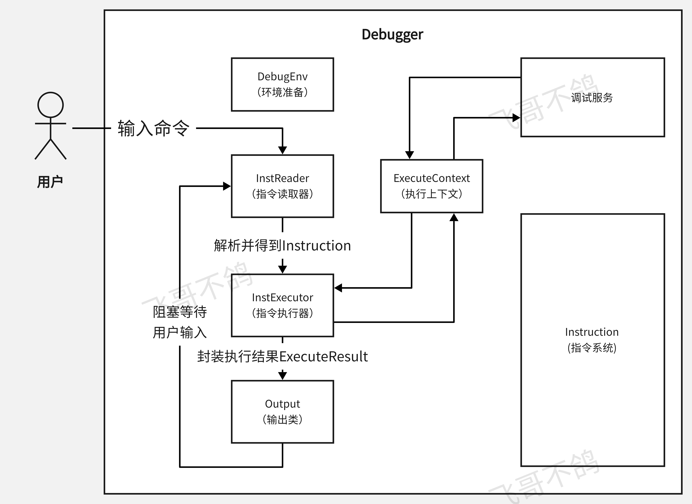


Debugger是所有debug框架的启动核心类，其中封装了所有的debug逻辑

DebugEnv是环境对象，用于构建Debug所需要的环境

Instruction代表debug框架的指令体系，每条指令对应着不同的执行逻辑

InstReader、InstExecutor、Output是整个debug流程的核心。分别负责`读取指令`, `执行指令`, `输出执行结果`

其中`InstExecutor`负责和**核心的调试服务**沟通，`ExecutorContent`是上下文对象，用于沟通执行器和调试服务。同时，上下文对象还能够沟通不同的**指令执行器**

调试服务，是整个框架最为核心的部分，它封装底层不同语言提供的调适能力，并进行代码控制，与Java插件进行交互


当前所有语言的Debug调试器均基于上述架构，后续如果需要新增不同语言的调试器，只要`调试服务`可以实现，那么这个语言就**具备接入Leetcode-runner**的能力


## Java调试服务

### 1.执行流程

Java的debug调试，核心借助JDI提供的各种接口，来实现对底层JVM的控制

有关JDI提供的接口内容，可自行查阅文档，或者阅读我的这篇文章——[《leetcode-runner》【图解】如何手搓一个debug调试器——调试程序【JDI开发】【万字详解】](https://blog.csdn.net/qq_62835094/article/details/145159294?spm=1001.2014.3001.5502)

JavaDebugger采用**多线程的方式处理**，其中`JavaDebugger`负责和用户交互，`JEventHandler`负责和**Debug的JVM**交互

其具体的执行流程可以用下图表示

其中JavaDebugger、JEvenHandler分别属于不同的线程


之所以采用多线程，是为了**避免死锁的出现**，有关死锁发生的场景，将会在后文介绍


### 2.死锁

死锁会发生在如下场景

假设只有单线程，那么如下情况会发生死锁

1. JavaDebugger调用`Value.invokeMethod`，阻塞等待执行结果，同时TargetVM恢复运行
2. TargetVM运行时会产生Event返回，交由JavaDebugger捕获
3. TargetVM执行产生一次Event后会暂停线程，等待被JavaDebugger放行
4. JavaDebugger依赖于TargetVM返回结果，TargetVM想返回结果，依赖于JavaDebugger放行（恢复线程），因此发生死锁

如果引入多线程，那么TargetVM依赖于JEventHandler放行，自然就不会出现死锁问题

不过需要注意的是，JEventHandler争对`Value.invokeMethod`需要做出特殊判断

`Value.invokeMethod`方法会要求TargetVM重新执行一次方法，在此期间会产生大量的**Step Event**（单步执行事件）

JEventHandler捕获**Step Event**，默认不会放行，这适用于绝大多数情况。但如果**JavaDebugger**执行`Value.invokeMethod`，则需要放行，否则TargetVM无法计算得到结果


### 3. 并发问题

因为多线程的引入，自然而然的会导致并发问题。具体来说，前台JavaDebugger在使用**Context**的数据时，后台**JEventHandler**线程对其进行更改，导致前台执行得到错误的数据

为了解决这一问题，在**Context**中引入协调器的概念

之所以产生并发问题，本质上是因为前台执行时，后台也在执行。而协调器的引入，则让JavaDebugger等待JEventHandler稳定后，再使用Context的数据并计算，从而避免后台线程更改数据时执行计算


### 4. 表达式计算

表达式计算，允许用户在debug过程中监控某些变量，或者对变量进行额外操作，或者调用方法提前计算

在JavaDebugger中，JDI底层**并没有**提供相应的计算功能，因此表达式计算功能是由Leetcode-runner实现。

有关表达式计算的详细内容，可以阅读我的这篇文章[《leetcode-runner》【图解】【源码】如何手搓一个debug调试器——表达式计算](https://blog.csdn.net/qq_62835094/article/details/145180305?spm=1001.2014.3001.5502)


在Leetcode-runner中，表达式被分为以下几种类型

- 纯变量（如a，b，c这种单纯变量）
- 数组（如arr[0]）
- 表达式计算（如1+2，a+b这种）
- 实例方法调用（如demo.invoke()）
- 纯方法调用（ dfs()，takeLocalValue(a) ）
- 纯常量（如1，3.14，“nihao”， ‘&’）
- 运算符（如+,-,*,/,<<,&等）

每种类型的表达式都会被对应的**对象封装**，同时对外提供统计的接口，用于提供计算结果，在Leetcode-runner种，**Token封装表达式内容+表达式计算功能**

**TokenFactory负责识别表达式并返回Token**，而TokenFactory的识别依赖于内部封装的**Rule**

**Rule**封装了表达式的识别逻辑，不同的Rule对应不同的Token，且只对应一个

对于复杂的表达式，可以通过TokenFactory解析得到Token，Token内部再通过TokenFactory递归解析，逐步拆解复杂表达式，将其拆分为若干简单表达式的组合，最终计算得到结果


**架构图：**

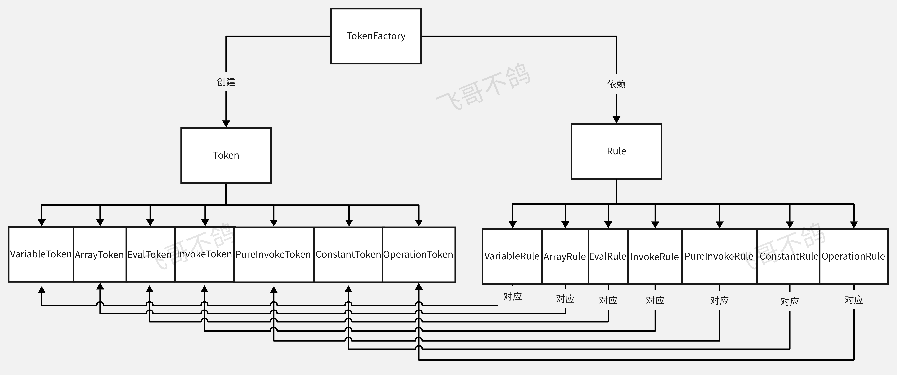


上述架构以及对应的功能已经能够解决计算绝大多数复杂的表达式，诸如`arr[b.invoke(1 + 2, c, arr2[0])] + dfs(1,2,c.invoke())`

它就可以按照如下规则拆分：

在计算表达式当中，存在一个数组表达式`arr[...]`，和纯函数调用表达式`dfs(...)`

在数组的维度信息中，存在一个`方法调用表达式——a.invoke(...)`。方法调用的内部，又可以拆分为`计算表达式1+2`，`纯变量表达式c`，`数组表达式arr2[0]`

在纯函数调用的括号内，存在两个`纯常量表达式——1，2`，存在一个`方法调用表达式c.invoke()`


尽管计算框架依然具备很强的计算逻辑，但它对于链式调用的Token依然束手无策，如`a.invoke().c[0][1]`

因此，再最新版本种，引入了链式调用这一概念——`TokenChain`


在leetcode-runner中，额外引入**TokenChain**，**RuleChain**。专门处理链式的计算

有关链式调用的详细介绍，可以参考我的这篇文章——[《leetcode-runner》【图解】【源码】如何手搓一个debug调试器——表达式计算](https://blog.csdn.net/qq_62835094/article/details/145180305?spm=1001.2014.3001.5502)


## Python调试服务

因为python和Java分属于不同语言，无法再同一个进程内运行，因此采用web的方式沟通

**架构图：**

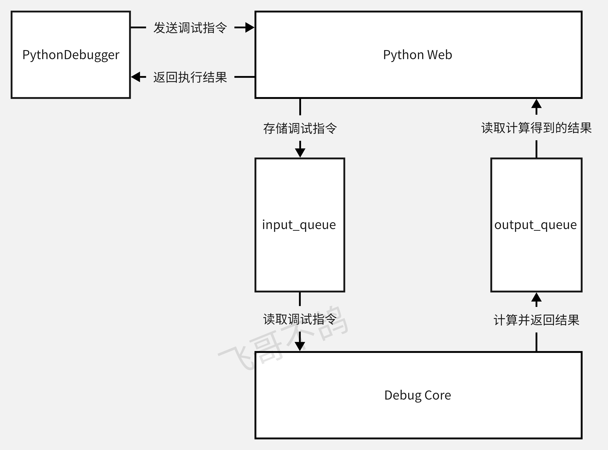

后续的C++Debug服务，整体架构类似于python，往后只要是需要接入Leetcode-runner的调试器，基本都会遵循如上架构

python的debug功能，主要基于`sys.settrace`方法，该方法会在python解释一行代码后，自动调用传入的回调函数。而所有的debug逻辑都写在回调函数内

另外，python内置的eval函数就具备表达式计算的功能，无需手动实现


## Cpp调试服务

Cpp调试服务，底层debug能力是由GDB提供。GDB的MI模式，会返回格式化数据，方便开发者解析

但是GDB并不能直接嵌入Leetcode-runner，因为它存在一个致命的缺陷——读取、输出都是工作在终端

GDB从标准输入读取数据，然后在标准输出显示数据，但在leetcode-runner中，不存在终端。这也是为什么Java、Python等debug服务都没有封装已有的调试器

但C++不同，C++具有**管道、重定向**等逆天功能，它可以手动控制GDB的输入输出，使其嵌入项目当中

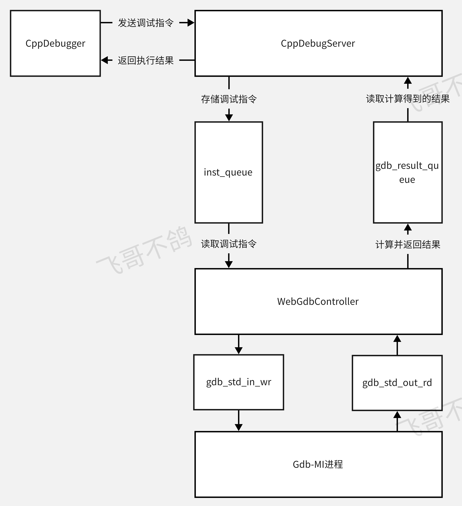


对于GDB-MI模式下输出的内容，全部交由**JavaDebugger**解析

解析工作由**GdbParser负责**，整套GDB解析学习了Gson的设计方式，整体不算复杂，但还是挺有意思的，更详细的内容请参考源码
