[TOC]

# README.md

## 插件介绍

`Leetcode-runner`是一款开源的Jetbrain产品插件。旨在实现一个核心功能完备，且简洁容易上手的Leetcode刷题插件。插件支持日常刷题所需的一切功能，如**代码编写**、**代码运行/提交**、**测试案例更换**、**运行结果显示**、**题解展示**、**提交记录展示**、**代码替换**、**测试案例替换**等功能，实现脱离Web端刷leetcode

此外，插件项目还提供另外三个极为强大的功能。分别是**大批量题目快速检索**、**核心代码断点调试**、**深度刷题**

本项目拥有详细的使用文档和开发文档，代码有着详细的注释且符合Java行业通用的开发规范

### 1. 加载插件

插件项目启动后，会出现两块工具栏

如果没有出现，可以通过`View -> Tool Windows -> Leetcode Console Plugin / Leetcode Plugin` 打开工具窗口

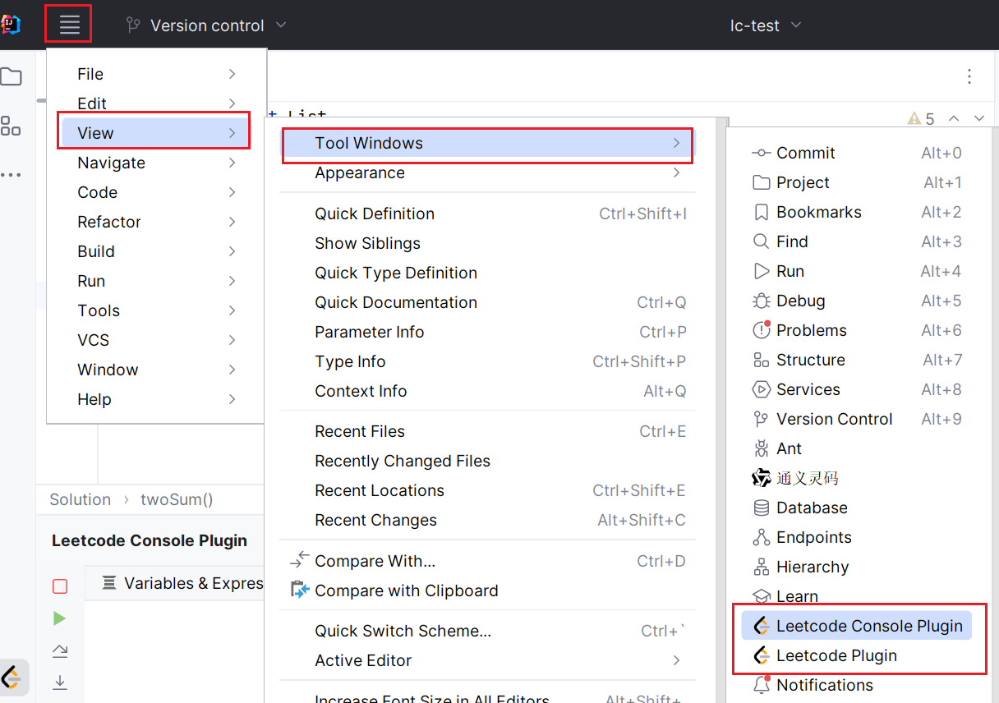

### 2. 插件初始化

1. 打开设置栏

   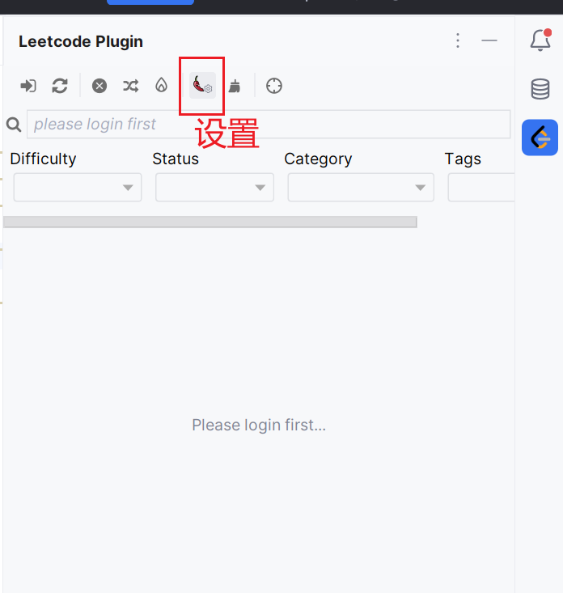

2. 选择lang type和store path

   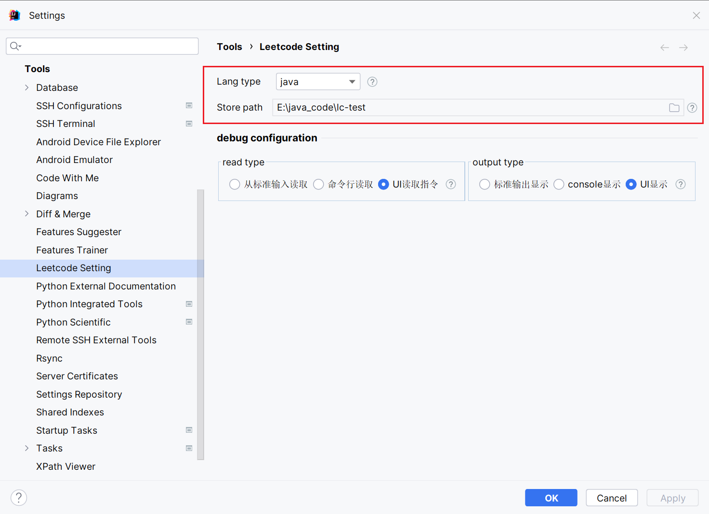

   > lang type: 指定当前用何种语言解决问题
   >
   > store path: 指定code文件创建的目录

   > tip: 有关各种设置的介绍，可以通过最右侧的问号图标得到解答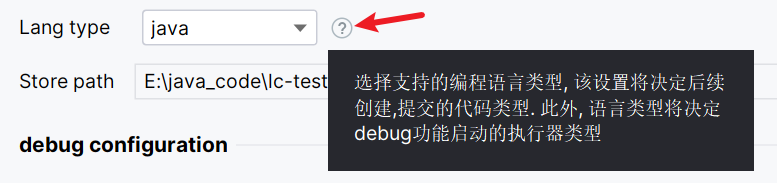

3. 点击登录按钮，进行登录操作

   

4. 正常情况下，插件会模拟浏览器，出现leetcode官网登录界面，具体如下

   

   如果登录成功，则会加载数据内容，并在右侧的工具栏中出现问题内容

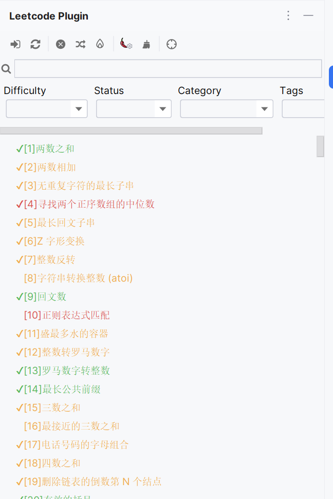

> tip: 第一次登录需要加载所有题目，这可能会耗费3-5s左右的时间，在此期间会在后台加载数据，并锁定部分功能。这是正常行为

### 3. 预览内容

点击右侧问题内容，插件会创建代码文件，并进行问题内容预览

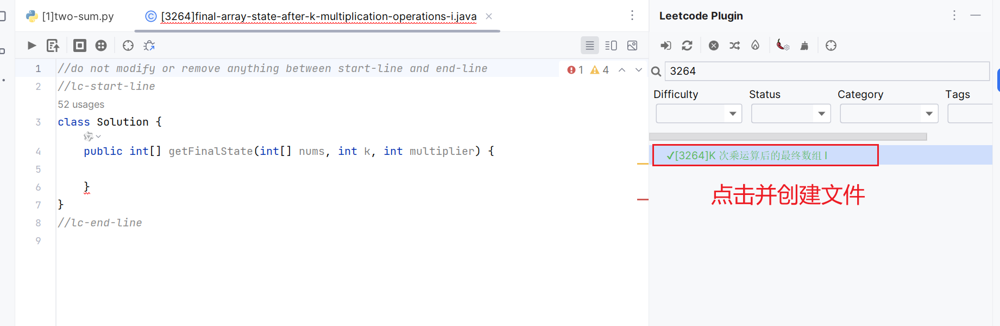

编辑栏右上角存在三个按钮

第一个按钮，会隐藏右侧内容，只留下代码部分

第二个按钮，保留左右两侧所有的内容

第三个按钮，会隐藏左侧代码编辑区域，只留下右侧部分

### 4. 运行代码

编辑栏左侧存在六个按钮，前三个和代码运行有关。后三个将在`辅助功能`中进行介绍

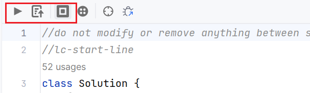

第一个按钮，runcode，使用题目的默认测试样例运行代码

第二个按钮，submit code

第三个按钮，Test Cases

点击第一、第二个按钮后，会在**插件自带的控制台**输出执行信息

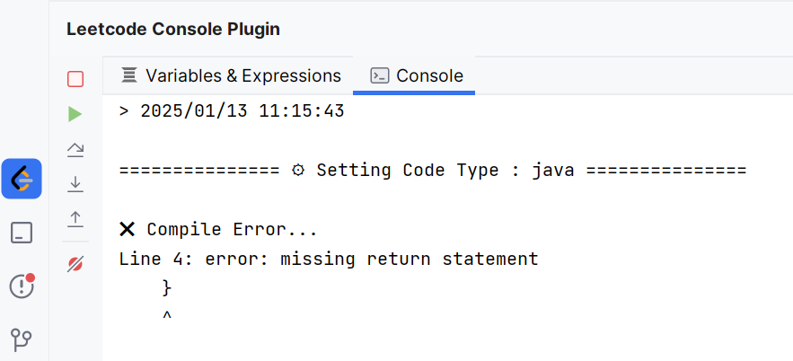

第三个按钮，会出现弹框，可以自定义测试数据

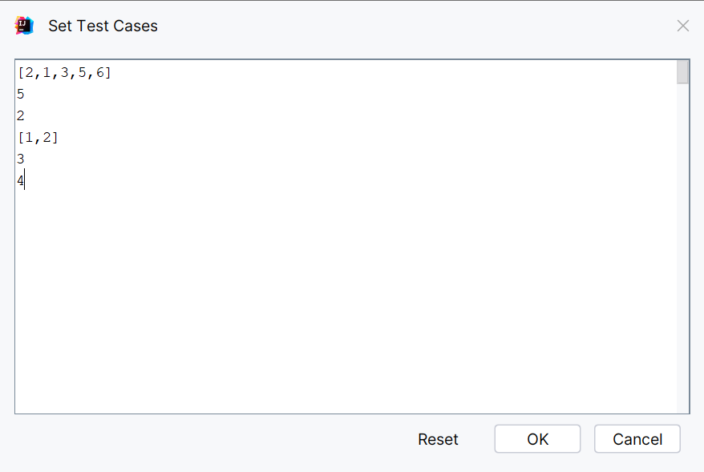

> Reset按钮可以恢复题目的默认测试样例

## 支持功能

**v3.4.0**

| 所属模块                       | 功能                              | 介绍                           |
| ------------------------------ | --------------------------------- | ------------------------------ |
| 登录                           | Web Auth                          | 模拟web登录                    |
|                                | Cookie Login                      | 设置cookie登录                 |
| 题目列表                       | list all                          | 展示所有题目                   |
|                                | pick one                          | 随机一题                       |
|                                | daily question                    | 每日一题                       |
|                                | search question                   | 搜索题目                       |
|                                | filter question                   | 筛选题目                       |
|                                | reposition                        | 重定位代码文件                 |
|                                | reload question                   | 重新查询题目                   |
|                                | reposition                        | 重定位并重新打开题目文件       |
| 题目详情                       | 题目展示                          | 题目展示                       |
|                                | 题解展示                          | 题解展示                       |
|                                | 提交记录展示                      | 提交记录展示                   |
|                                | 提交记录代码替换                  | 提交记录代码替换               |
|                                | 提交记录代码copy                  | 提交记录代码copy               |
|                                | 错误提交记录的错误信息呈现        | 错误提交记录的错误信息呈现     |
|                                | 错误提交记录的错误测试案例新增    | 错误提交记录的错误测试案例新增 |
|                                | 错误提交记录的错误测试案例copy    | 错误提交记录的错误测试案例新增 |
| coding editor                  | Run Code                          | 运行代码                       |
|                                | Submit Code                       | 提交代码                       |
|                                | Test cases                        | 设置测试案例                   |
|                                | default Code                      | 恢复默认代码                   |
|                                | RePosition                        | 定位代码                       |
|                                | Debug                             | 调试当前代码                   |
| plugin setting                 | 设置语言                          | 设置语言                       |
|                                | 设置存储路径                      | 设置存储路径                   |
|                                | 设置debug read type               | 设置debug read type            |
|                                | 设置debug output type             | 设置debug output type          |
| debug【支持指令】              | run                               | 运行代码                       |
|                                | b 行号                            | 在对应行添加断点               |
|                                | step into                         | step into                      |
|                                | step over                         | step over                      |
|                                | step out                          | step out                       |
|                                | p                                 | 打印当前变量                   |
|                                | p exp                             | 计算表达式exp                  |
|                                | watch exp                         | 监视表达式exp                  |
|                                | remove b 行号                     | 移除断点                       |
|                                | remove all b                      | 移除所有断点                   |
|                                | show b                            | 展示所有断点                   |
|                                | w                                 | 显示当前执行代码               |
|                                | help                              | help指令，显示所有命令行功能   |
|                                | stop/quit                         | 终止debug                      |
| debug【模块功能-read模块】     | 标准输入读取指令                  |                                |
|                                | 命令行读取指令                    |                                |
|                                | 通过UI读取指令                    |                                |
| debug【模块功能-execute模块】  | Java debug执行                    |                                |
|                                | python debug执行                  |                                |
| debug【模块功能-output模块】   | 标准输出显示结果                  |                                |
|                                | Console显示结果                   |                                |
|                                | UI显示结果                        |                                |
| debug【模块功能-标准输出捕获】 | 支持Java代码的stdout/stderr捕获   |                                |
|                                | 支持python代码的stdout/stderr捕获 |                                |

## 插件安装

在大于等于v3.5.0版本，Leetcode-Runner发布到Jetbrain的插件市场，需要的用户可以从插件市场中下载. 如果想要下载低于该版本的插件，可以按照下文介绍的方法安装

1. 在根目录下找到/jar/目录，里面有打包好的插件jar包【或者可以自行通过gradle打包项目】

   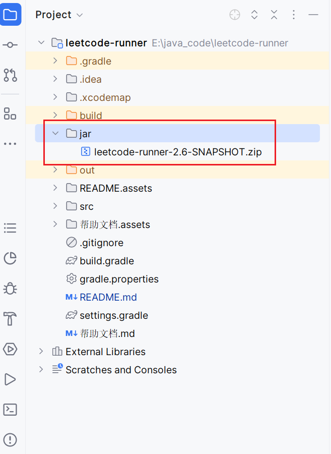

2. 打开自己的idea，File->Settings->Plugin，打开插件设置界面

   

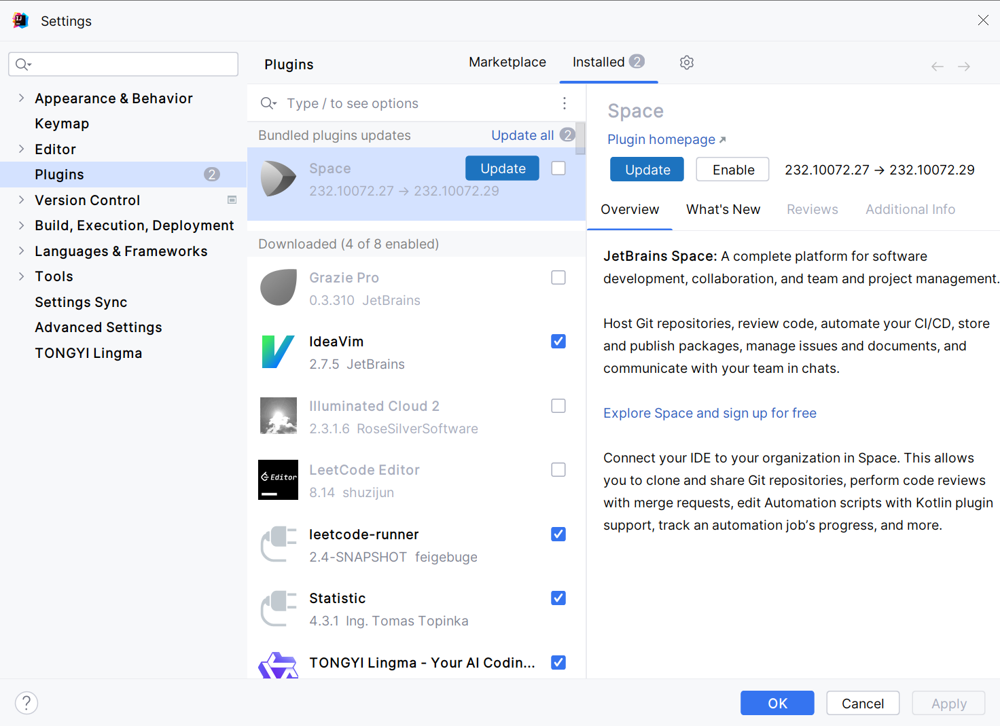

3. 点击齿轮图标，选择从disk安装plugin

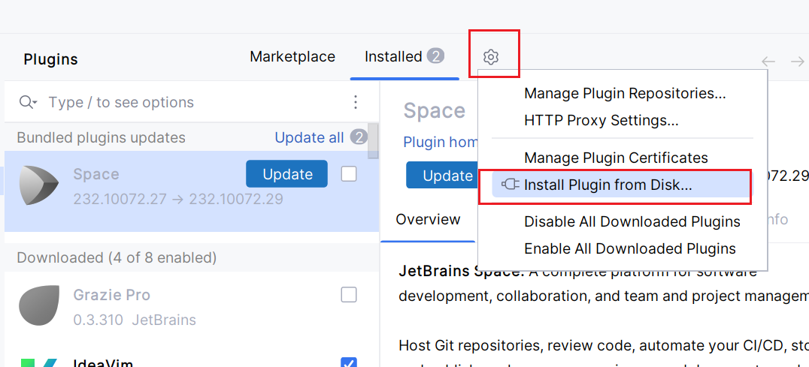

4. 选择第一步获取的jar包，点击确定

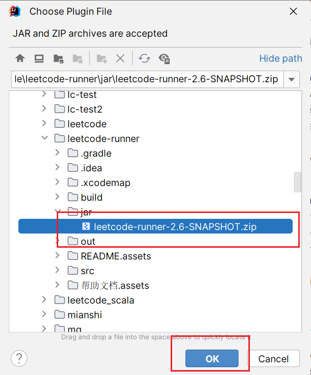

5. 当出现Restart IDE按钮时，就表示插件安装成功！

## 辅助功能介绍

### 1 default code

恢复默认代码，能将当前打开的文件按照设置的语言恢复为默认代码

### 2. Reposition

> 该功能在v2.6.4版本引入

该功能所在位置如图所示

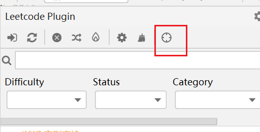

在插件使用的时候，可能出现如下情况。原本的code文件无法通过插件提供的编辑器形式打开，具体如下图所示

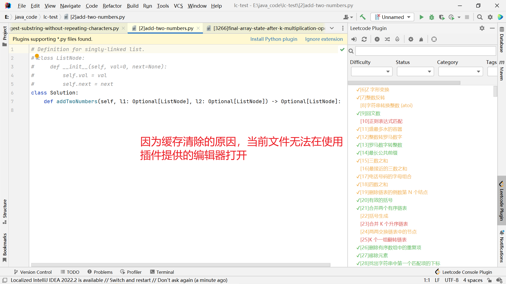

`Reposition`允许用户重新定位当前文件所代表的问题，重新加载文件，并通过插件提供的编辑器打开

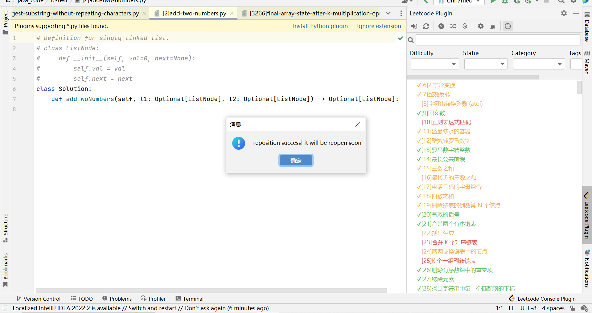

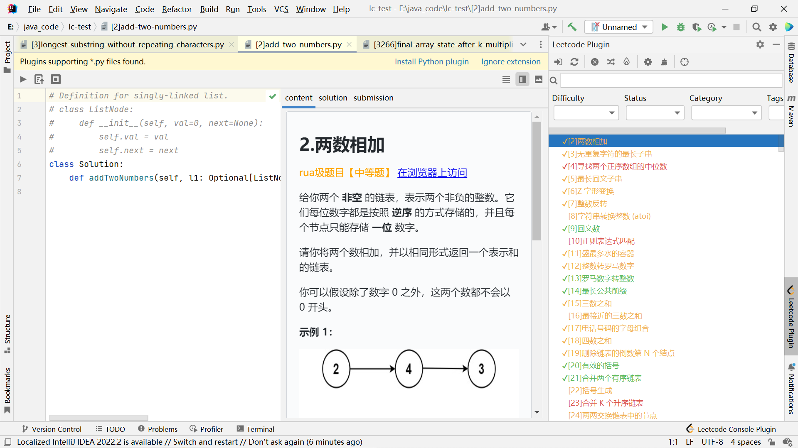

### 3. submission界面

在大于等于2.6.4版本中，针对提交界面做出了优化，额外增加`显示错误信息`, `代码替换`，`新增测试样例`功能，具体如下

对于错误的提交记录，界面不仅显示历史代码，还会在Top栏显示错误原因，以及测试样例等信息

另外，大于等于v.2.6.4的版本允许用户直接替换代码，新增测试样例

**代码cv/替换**

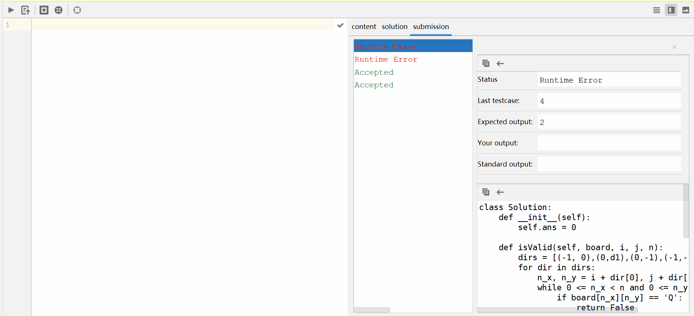

**测试样例cv/新增**

### 4. 每日一题

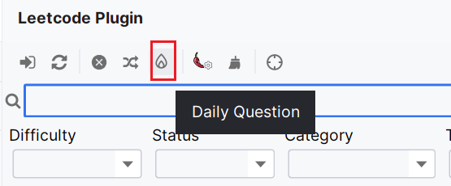

点击按钮，将获得当天需要完成的每日一题，该功能也是作者常用的功能，桀桀

### 5. 搜索 + 筛选功能

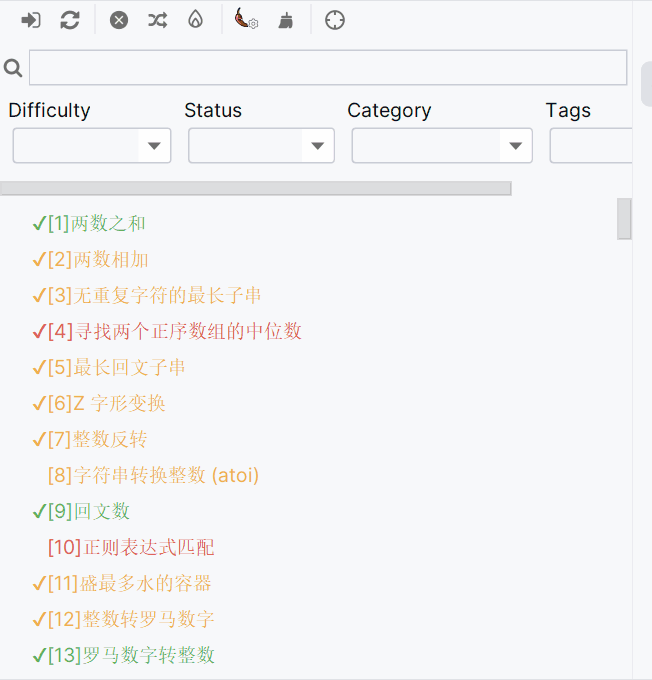

### 3. debug

debug模块是leetcode-runner提供的一个较为强大的功能。该功能允许用户无需任何操作，省去函数入口编写，测试案例转换等诸多繁琐的额外编码，直接对核心代码断点调试，且适用于绝大部分的leetcode题目。值得一提的是，市场上同类型的插件产品**都不支持对核心代码debug调试**，且该功能在leetcode官网使用需要付费

在3.5.0版本中，leetcode-runner支持Java、Python、C++的代码断点调试。支持`运行`, `step over`，`step into`，`step out`，`打印局部、成员、静态变量`，`表达式计算`，`表达式监视`，`执行代码高光`等诸多功能。并且支持标准输入读取、命令行读取、UI读取 + 标准输出显示、控制台显示 、UI显示等组合功能
> tip: C++不支持目标代码的标准输出+标准错误的捕获

[视频介绍链接](https://www.bilibili.com/video/BV15tc1eLEpa/)

#### 3.1. debug设置

在使用debug功能前，系统会进行配置检测。如果debug configuration为空，则会自动弹出设置界面，要求进行debug配置

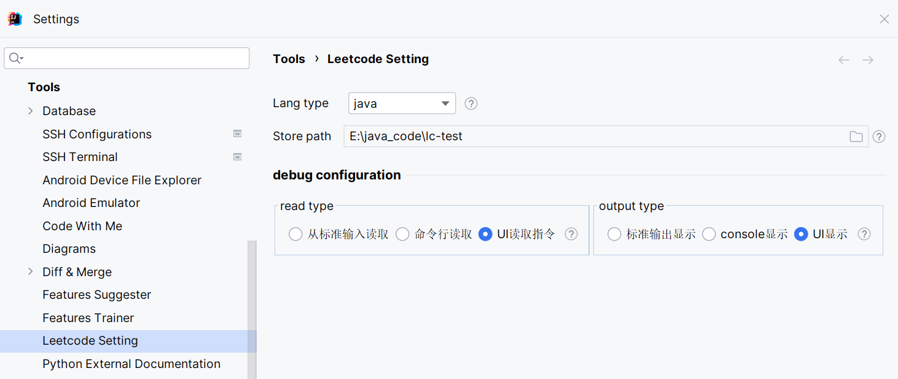

- read type
  - 设置debug模式下, 指令输入来源。推荐使用UI指令读取。标准输入读取指令/命令行读取指令适合熟悉命令行的开发人员

- output type
  - 设置debug模式下, 调试内容显示位置。推荐使用UI显示。标准输出显示/console显示适合熟悉命令行的开发人员

#### 3.2. 启动debug功能

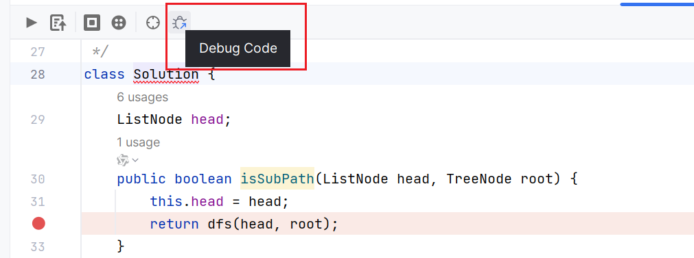

点击debug按钮，开启debug功能

随后系统将会弹出引导对话框，要求用户进行必要的设置

- Java目录选择

  - 该选择要求用户指定debug启动的Java版本，指定Java目录后，系统会自动检测{home}\bin\java.exe是否存在

    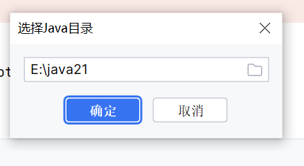

  - 如果不存在，则会报错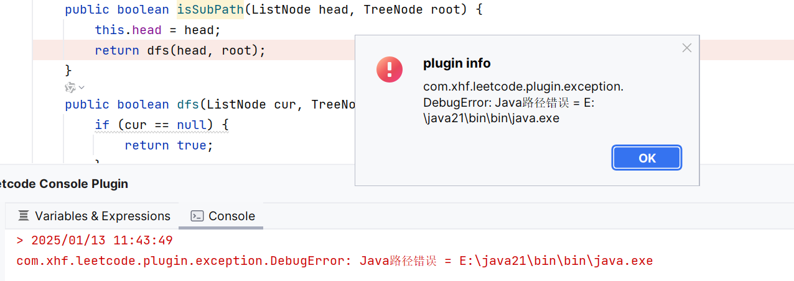

- 测试案例选择

  - 有关测试案例，系统只允许提供一轮的测试案例

    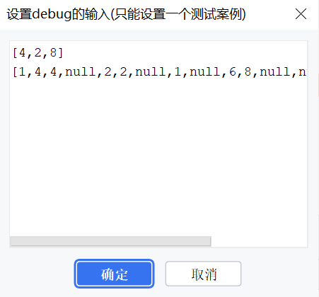

  - 如果提供多轮，系统则会报错

    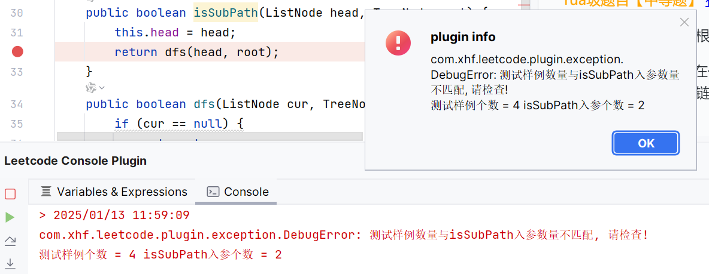

#### 3.3. debug成功

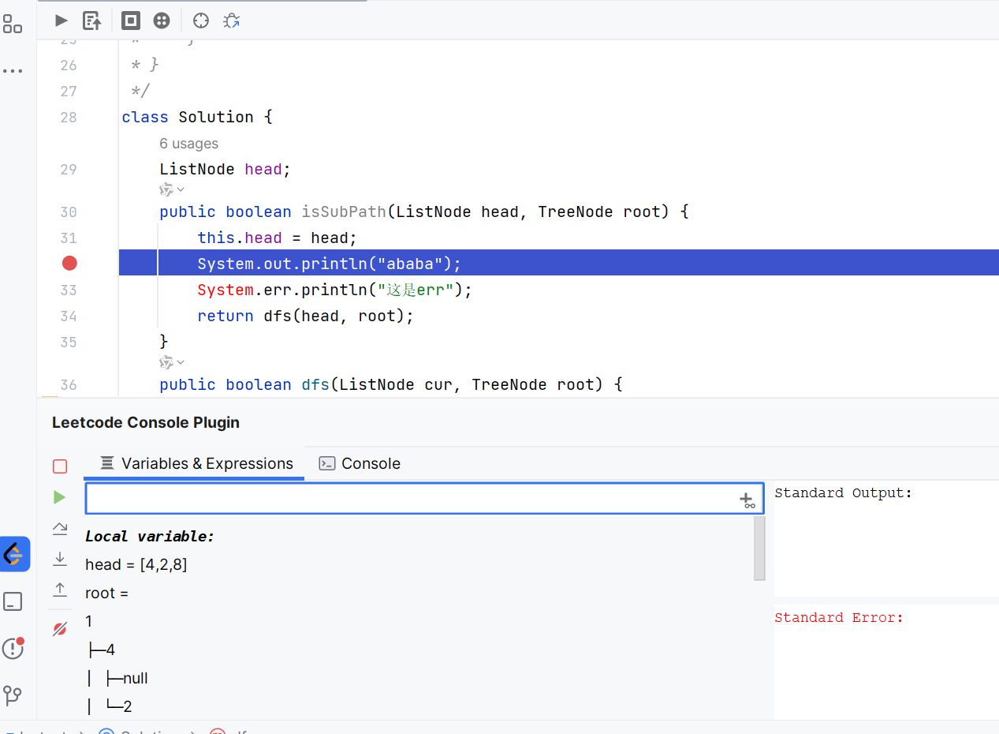

### 4. 深度刷题

> 该功能在v3.6.0版本引入

Leetcode平台共有接近4000道题目，题目质量层次不齐，用户难以找到适合自己的题目。为了解决这一问题，Leetcode-Runner引入**深度刷题**功能，通过提供不同类型的优质题库，细分题目定位，为用户提供更高质量且符合用户当前水平的题目

该功能入口为如下图标

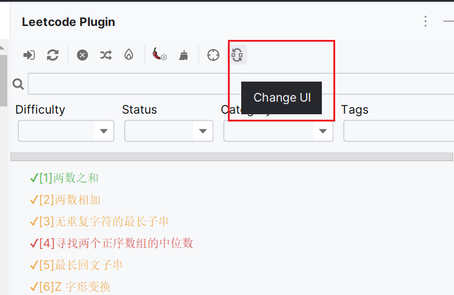

点击该按钮后，进入深度刷题模式

如果想要返回正常的刷题模式，再次点击该按钮即可

在深度刷题模式下，总共存在三类题库，分别是`Hot 100题`，`经典面试150题`，`LC-竞赛题`

在深度刷题模式下创建的题目会有更为丰富的编码界面，具体如下图标红区域

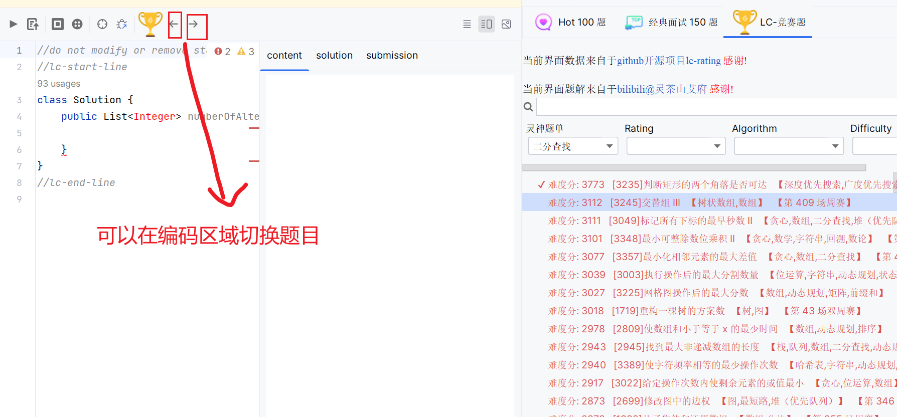

该功能具体演示如下：

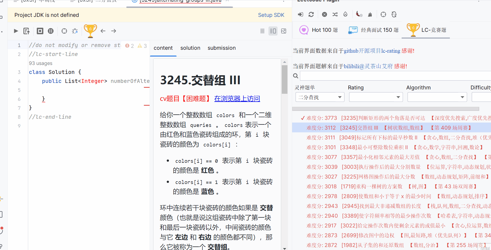

值得一提的是，在`LC-竞赛题`模式下，支持**灵神的题单**，如果你是一位leetcode刷题者，很难不了解灵神这位大佬，他的题解清晰明了，简单易懂，对每一位刷题者都有着极大的帮助

在Leetcode-Runner中，如果你想要查看灵神的题单，可以通过选择`灵神题单`下拉框选择的内容，点击后则会显示灵神题单

对于题单中存在的链接，Leetcode-Runner会进行跳转拦截，对于可以集成到Leetcode-Runner中的链接，系统则会提供打开方式，否则会通过Web浏览器打开

## 可能遇到的bug

### 1.题目内容没有以markdown形式呈现

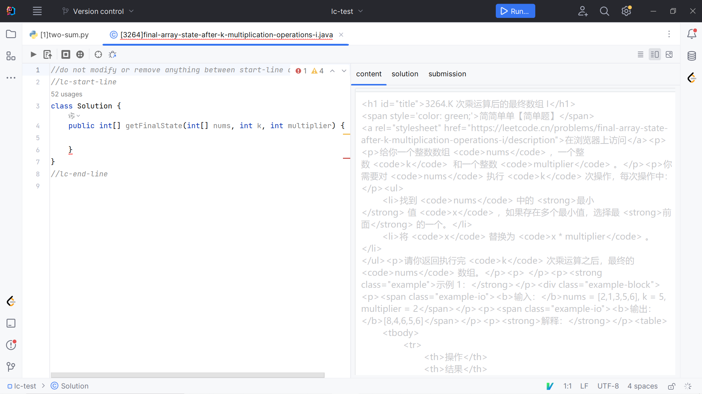

点击solution或者submission, 然后再切换回content. 如果html还未渲染完毕, 可通过Reposition功能重新打开

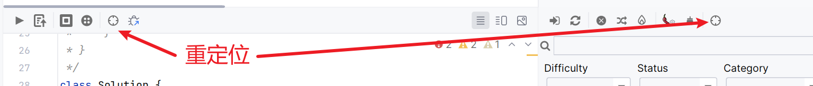

### 2. 过滤得不到任何题目

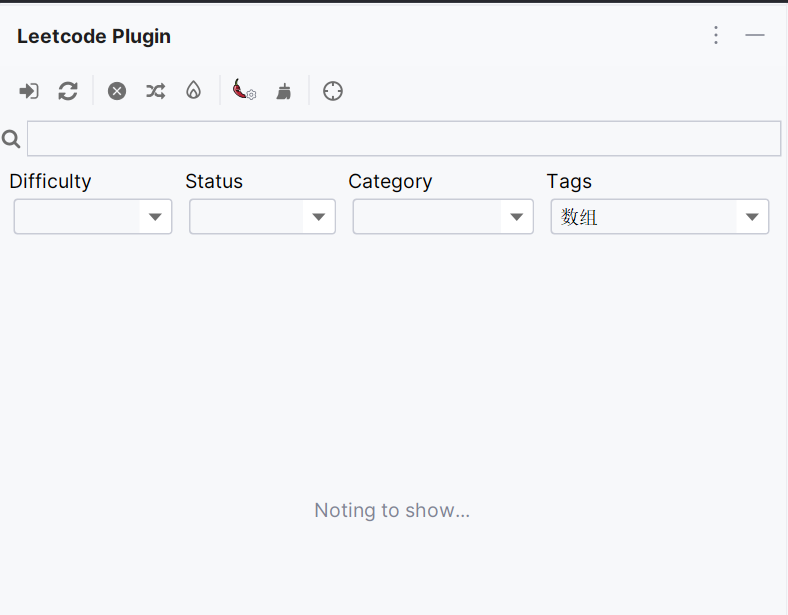

点击reload question，重新查询题目

### 3. Cpp debug 文件编译错误

该问题在**v3.5.0**增加cpp debug功能时引入，其产生原因是c++debug server没有正常退出，导致**ServerMain.exe**，**solution.exe**所在进程并未被正常销毁
作者目前也在尝试着解决这个问题，但并未提供一个安全的解决方案
此时需要用户手动杀死相关进程，关于solution.exe，ServerMain.exe所在路径会在console中显示，具体如下

进入console显示的目录，尝试删除文件，发现删除失败

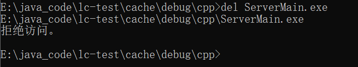

这是因为ServerMain.exe被C++进程持有，需要先杀死对应进程，才能删除文件
**杀死占有.exe的进程**
- 方案一：

  在终端输入`tasklist | findstr ServerMain.exe`，得到的第二个输出就是ServerMain.exe启动程序占用的端口
  然后通过`taskkill /F /PID {端口}`杀死进程，即可终止占用ServerMain.exe的程序
  此时可以删除ServerMain.exe
  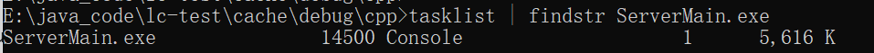
- 方案二：
  重启电脑，通过重启强制杀死所有的程序，此版可以删除ServerMain.exe

### 4. vm 连接失败

导致该错误的原因有两种

1. debug启动时设置的jdk版本过低
2. std_log.log和std_err.log被其他文件占用

如果是原因1，可选择启动低版本的jetbrains或者选择高版本的jdk，当然最保险的方式还是选择jetbrains自带的jdk，jetbrains产品自带的jdk路径为`${安装目录}\jbr\bin\java.exe`，比如`D:\PyCharm 2024.1.3\jbr\bin\java.exe`

需要说明的是，在debug阶段开始前的填写路径阶段，请不要输入完整路径，而是输入根路径，比如`${安装目录}\jbr`，系统会自动添加`\bin\java.exe`

值得一提的是，在3.6.4版本中，Leetcode-Runner通过改变JVM启动策略从而解决因为jetbrains版本过高而无法启动低版本jdk的问题

如果是原因2，用户会在console控制台中看到std_log.log和std_err.log两个文件的路径

如果尝试删除, 则会出现**文件已被占用的报错**

此时需要采取强制手段删除

可以选择重启，又或者选择杀死占用文件的进程，具体操作如下：

在任务管理器中打开资源监视器

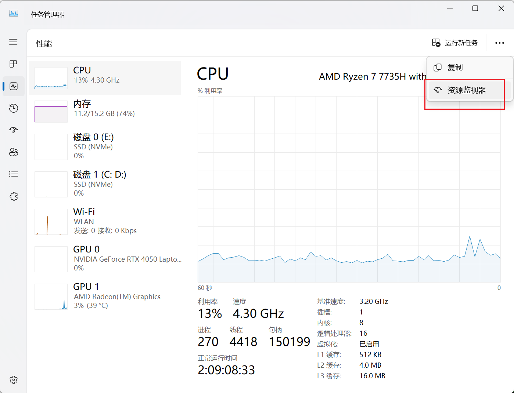

在资源监视器中选择`CPU`，在关联的句柄中搜索`std_log.log`，找到相关程序，并将其杀死

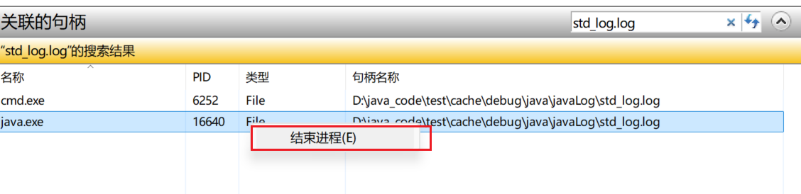

切忌将系统级别的重要进程终结，在终结进程前请确认句柄名称！！！

### 5. Android Studio出现JCEF登录失败

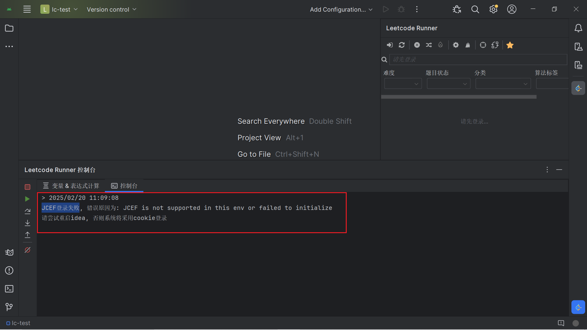

解决方法
Android studio Go to Help -> Find action

搜索 Choose Boot Java Runtime for the IDE

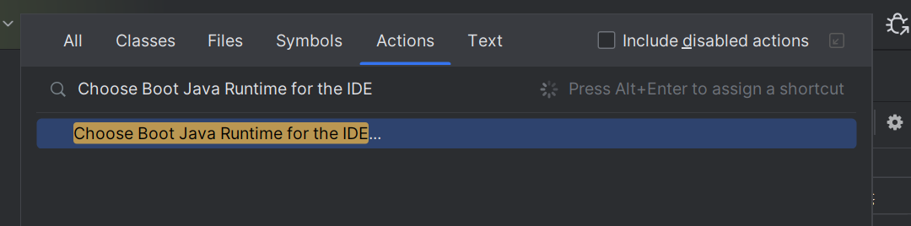

选择JCEF运行的JDK

确认，等待idea下载即可

### 6. JCEF登录失败

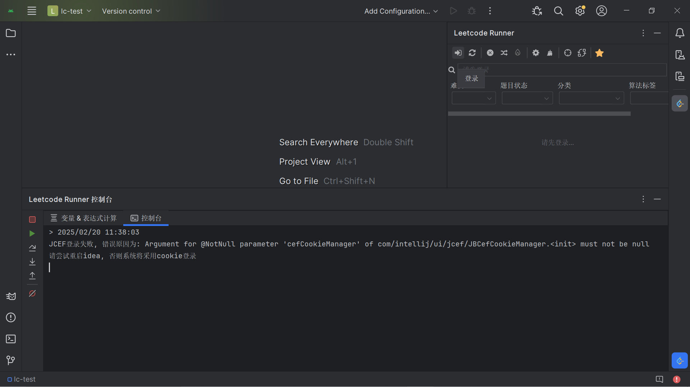

