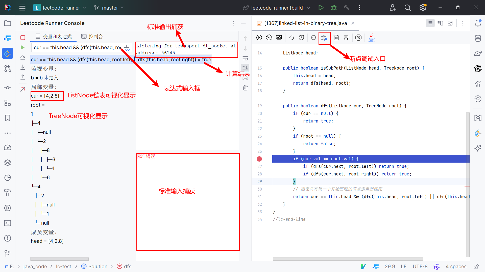
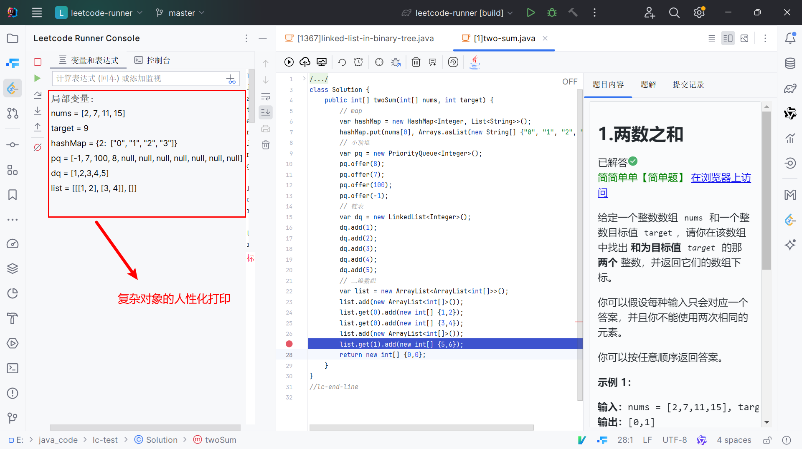
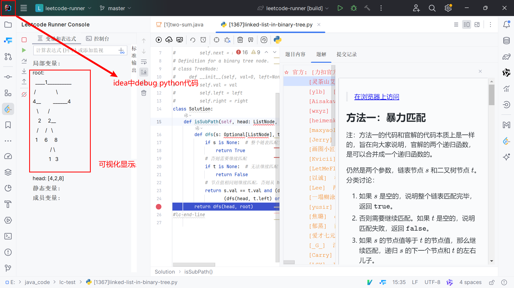

# Leetcode Runner 刷题插件


<div align=center>
<a href="https://github.com/xuhuafeifei/leetcode-runner" title="License" target="_blank">

</a>
<a href="https://github.com/xuhuafeifei/leetcode-runner" title="Release" target="_blank">

</a>
<a href="https://github.com/xuhuafeifei/leetcode-runner" title="GitHub Stars" target="_blank">

</a>
<a href="https://github.com/xuhuafeifei/leetcode-runner" title="GitHub Forks" target="_blank">

</a>
<a href="https://github.com/xuhuafeifei/leetcode-runner" title="GitHub Forks" target="_blank">

</a>
</div>

📚 [在线文档](https://itxaiohanglover.github.io/leetcode-runner-doc/)

## 简介

`Leetcode-runner`是一款开源的Jetbrain产品插件。旨在实现一个核心功能完备，且简洁容易上手的Leetcode刷题插件。插件支持日常刷题所需的一切功能，如**代码编写**、**代码运行/提交**、**测试案例更换**、**运行结果显示**、**题解展示**、**提交记录展示**、**代码替换**、**测试案例替换**等功能，实现脱离Web端刷leetcode

此外，插件项目还提供另外三个极为强大的功能。分别是**大批量题目快速检索**、**核心代码断点调试**、**深度刷题**

当前采用的技术栈： 等。

## 项目源码

| 平台     | 代码                                                                          | 
|:-------|:------------------------------------------------------------------------------| 
| Gitee  | [leetcode-runner](https://github.com/xuhuafeifei/leetcode-runner)          | 
| GitHub | [leetcode-runner](https://github.com/xuhuafeifei/leetcode-runner) |

## 项目起源


## 系统功能


### 本地刷题支持
作为一款Jetbrains IDE插件，它提供了本地刷题的支持，即在IDE中直接编写代码，并提交到Leetcode平台进行测试和运行。

插件支持代码编写，测试案例设置，运行结果可视化，题目查看，题解查看，提交记录查看等诸多功能。


### 核心断点调试功能
Leetcode题目都是核心代码模式，即只给出Solution，而没有main函数。这使得调试变得更加困难，因为无法直接运行代码。如果用户想要调试，需要手动编写**大量多余代码**，手动将测试案例转换为对应代码。如果遇到链表或者二叉树等复杂数据结构，**极容易出错**。

为了解决这一问题，Leetcode-Runner**内置调试系统**，<u>支持多种语言，无需额外编码，一键调试Solution代码</u>。

此外，针对不同的数据结构，Leetcode-Runner还对数据进行优化。譬如Java的Map，Set，LinkedList等数据结构，给出更为人性化的显示方案。

**java**


**java**


**python**


**cpp**


## 快速开始

> [!TIP]
> 更详细的流程，请查看在线文档[《快速开始》](https://itxaiohanglover.github.io/leetcode-runner-doc/)。

## 项目结构

```
─leetcode_runner
    └─plugin
        ├─actions
        ├─bus
        ├─comp
        ├─debug
        │  ├─analysis
        │  │  ├─analyzer
        │  │  └─converter
        │  ├─command
        │  │  ├─operation
        │  │  ├─parameter
        │  │  └─parser
        │  ├─debugger
        │  ├─env
        │  ├─execute
        │  │  ├─cpp
        │  │  ├─java
        │  │  └─python
        │  ├─instruction
        │  ├─output
        │  ├─reader
        │  └─utils
        ├─editors
        ├─exception
        ├─io
        │  ├─console
        │  ├─file
        │  └─http
        ├─listener
        ├─model
        ├─render
        ├─review
        │  ├─backend
        │  │  ├─algorithm
        │  │  ├─card
        │  │  ├─database
        │  │  ├─model
        │  │  └─service
        │  └─front
        ├─search
        │  ├─dict
        │  ├─engine
        │  ├─lucence
        │  ├─process
        │  └─utils
        ├─service
        ├─setting
        ├─utils
        └─window
            ├─deepcoding
            │  └─filter
            └─filter
```

## 贡献指南

欢迎各路好汉一起来参与完善 Leetcode-runner，我们期待你的 PR！

- 贡献代码：代码地址 [Leetcode-runner](https://github.com/xuhuafeifei/leetcode-runner)，欢迎提交 Issue 或者 Pull Requests。
- 维护文档：文档地址 [Leetcode-runner-doc](https://github.com/itxaiohanglover/leetcode-runner-doc)，欢迎参与修订。

如果您想提交新功能或优化现有代码，可以按照以下步骤操作：

1. 首先，在 Gitee 或 Github 上将项目 fork 到您自己的仓库
2. 然后，将 fork 过来的项目（即您的项目）克隆到本地
3. 切换到当前仍在维护的分支（请务必充分了解分支使用说明，可进群联系维护者确认）
4. 开始修改代码，修改完成后，将代码 commit 并 push 到您的远程仓库
5. 在 Gitee 或 Github 上新建 pull request（pr），选择好源和目标，按模板要求填写说明信息后提交即可，会大大增加批准合并率）
6. 最后，耐心等待维护者合并您的请求即可

请记住，如果您有任何疑问或需要帮助，我们将随时提供支持。

## 鸣谢

### 鸣谢

感谢参与贡献的每一位小伙伴🥰

<a href="https://github.com/xuhuafeifei/leetcode-runner/graphs/contributors">
  
</a>

## GitHub Star 趋势


