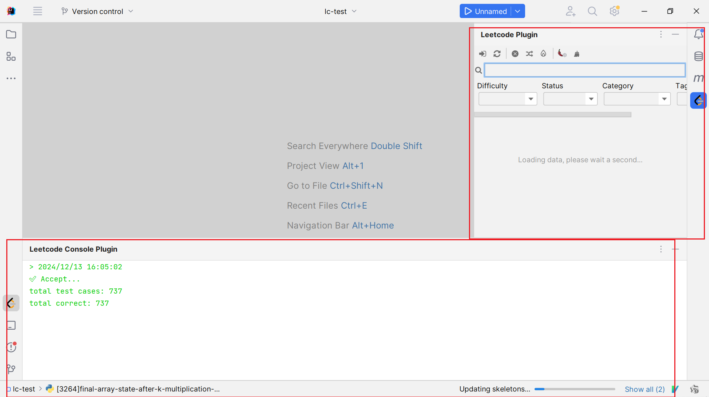

[TOC]

# README.md

## 插件介绍

`Leetcode-runner`是一款idea插件，旨在实现一个核心功能完备，且简洁容易上手的LC刷题插件。Leetcode-runner支持日常刷题所需的一切功能，实现脱离Web端LeetCode刷算法

### 1. 加载插件

插件项目启动后，会出现两块工具栏

如果没有出现，可以通过`View -> Tool Windows -> Leetcode Console Plugin / Leetcode Plugin` 打开工具窗口

### 2. 插件初始化

1. 打开设置栏

   

2. 选择lang type和store path

   > lang type: 指定当前用何种语言解决问题
   >
   > store path: 指定code文件创建的目录

3. 点击登录按钮，进行登录操作

   

4. 正常情况下，插件会模拟浏览器，出现leetcode官网登录界面，具体如下

   

   如果登录成功，则会加载数据内容，并在右侧的工具栏中出现问题内容

> tip: 第一次登录需要加载所有题目，这可能会耗费3-5s左右的时间，在此期间会在后台加载数据，并锁定部分功能。这是正常行为

### 3. 预览内容

点击右侧问题内容，插件会创建代码文件，并进行问题内容预览

编辑栏右上角存在三个按钮

第一个按钮，会隐藏右侧内容，只留下代码部分

第二个按钮，保留左右两侧所有的内容

第三个按钮，会隐藏左侧代码编辑区域，只留下右侧部分

### 4. 运行代码

编辑栏左侧存在三个按钮

第一个按钮，runcode，使用题目的默认测试样例运行代码

第二个按钮，submit code

第三个按钮，Test Cases

点击第一、第二个按钮后，会在**插件自带的控制台**输出执行信息

第三个按钮，会出现弹框，可以自定义测试数据

Reset按钮可以恢复题目的默认测试样例

## 插件安装

当前版本，leetcode-runner并未在idea的插件市场上注册，如果想要使用插件，需要通过手动方式按照

1. 在根目录下找到/jar/目录，里面有打包好的插件jar包【或者可以自行通过gradle打包项目】

   

2. 打开自己的idea，File->Settings->Plugin，打开插件设置界面

   

3. 点击齿轮图标，选择从disk安装plugin

4. 选择第一步获取的jar包，点击确定

5. 当出现Restart IDE按钮时，就表示插件安装成功！

